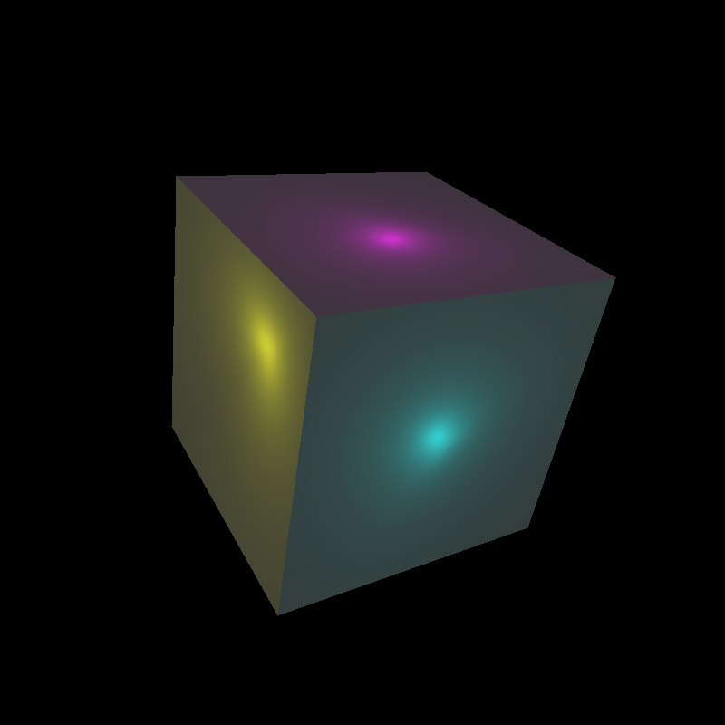
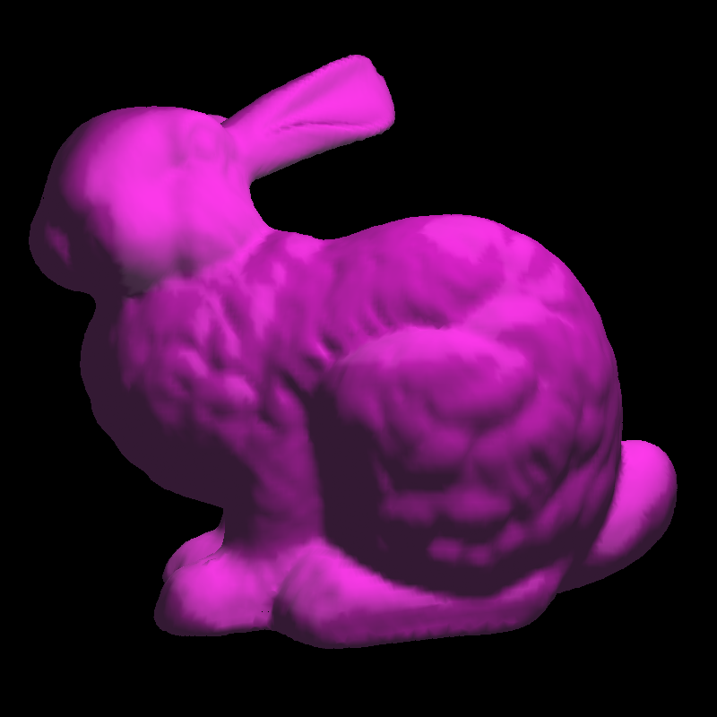

To render a scene, cd into the src folder, then type in the terminal "./shaded_renderer [../data/SCENE] [xres] [yres] [mode]", where SCENE is the scene you want to render, xres is the x-dimension of the image, yres is the y-dimension of the image, and mode is 0 for Gouraud shading and 1 for Phong shading.

Example: 

# Render cube
```bash
./shaded_renderer ../data/scene_cube2.txt 800 800 1
```



Example: 

# Render bunny
```bash
./shaded_renderer ../data/scene_bunny1.txt 800 800 1
```


